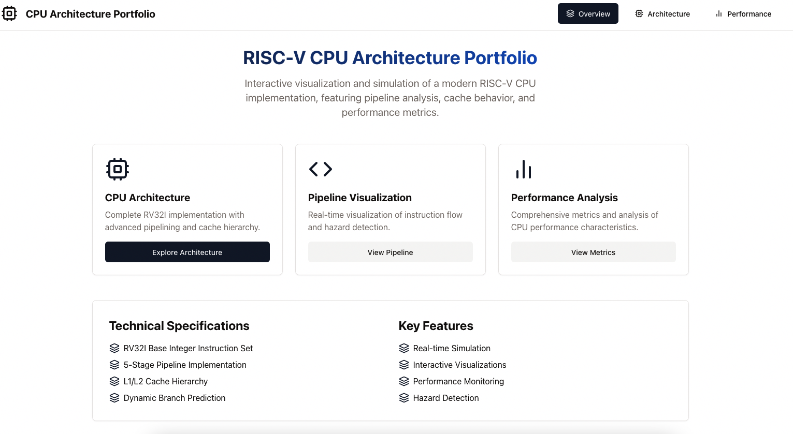
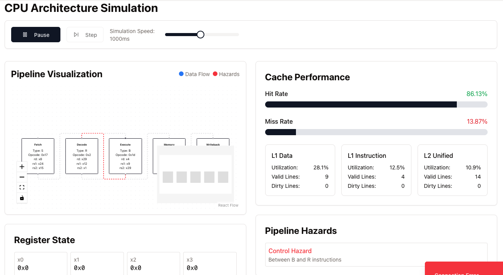

# CPU Architecture Simulation

An interactive web-based CPU architecture simulator that demonstrates pipelining, cache hierarchies, and performance metrics in real-time.




## Features

- **RV32I Base Integer Instruction Set simulation**
- **5-Stage Pipeline Implementation** with hazard detection and visualization
- **Cache Hierarchy** simulation (L1/L2)
- **Dynamic Branch Prediction**
- **Real-time Performance Metrics**
- **Interactive Visualizations**

## Technical Stack

### Frontend
- React 18 with TypeScript
- Vite for build tooling and development
- TanStack Query for data management
- Tailwind CSS with Shadcn/UI components
- Three.js/React Three Fiber for 3D visualizations
- WebSocket connection for real-time updates

### Backend
- Express.js server with TypeScript
- WebSocket server for real-time simulation updates
- PostgreSQL database with Drizzle ORM
- Session-based authentication

## Project Structure

```
├── client/              # Frontend React application
│   ├── src/
│   │   ├── components/  # Reusable UI components
│   │   ├── lib/        # Utility functions and configurations
│   │   └── pages/      # Main application pages
├── server/              # Backend Express application
│   ├── index.ts        # Server entry point
│   ├── routes.ts       # API route definitions
│   └── vite.ts         # Vite development server setup
└── db/                 # Database configuration and schema
    ├── index.ts        # Database connection setup
    └── schema.ts       # Drizzle ORM schema definitions
```

## Getting Started

1. The application runs on port 5000 by default
2. Use `npm run dev` to start the development server
3. The frontend will be served through Vite's development server
4. WebSocket connections are available at `/ws` for real-time updates

## Main Features

### Architecture Simulation
- Visualizes the CPU pipeline stages
- Shows data flow through different components
- Identifies and displays pipeline hazards
- Simulates cache behavior and memory access

### Performance Monitoring
- Real-time IPC (Instructions Per Cycle) tracking
- CPI (Cycles Per Instruction) measurements
- Branch prediction statistics
- Cache hit/miss ratios

### Interactive Controls
- Start/Stop simulation
- Step-by-step execution
- Adjustable simulation speed
- Real-time metric updates

## API Endpoints

- `GET /api/simulation/state` - Get current simulation state
- WebSocket `/ws` - Real-time simulation updates

## WebSocket Events

### Client -> Server
- `START_SIMULATION` - Begin simulation
- `STOP_SIMULATION` - Pause simulation
- `UPDATE_METRICS` - Update performance metrics

### Server -> Client
- `SIMULATION_STARTED` - Simulation has begun
- `SIMULATION_STOPPED` - Simulation has paused
- `METRICS_UPDATED` - New metrics available

## Development

The project uses TypeScript for type safety and Vite for fast development. The development server provides HMR (Hot Module Replacement) for quick iterations.

## Database Schema

The project uses Drizzle ORM with PostgreSQL, currently implementing:

- Users table for authentication
- Performance metrics storage
- Simulation state persistence

## Environment Setup

The project requires a PostgreSQL database URL in the environment variables:
```
DATABASE_URL=postgresql://...
```

## Performance Considerations

- WebSocket connections handle real-time updates efficiently
- Client-side rendering with React for smooth interactions
- Server-side simulation processing to reduce client load

## Deployment

The project is configured for deployment on Replit with:
- Build command: `npm run build`
- Start command: `npm run start`
- Port: 5000

## License

MIT License
